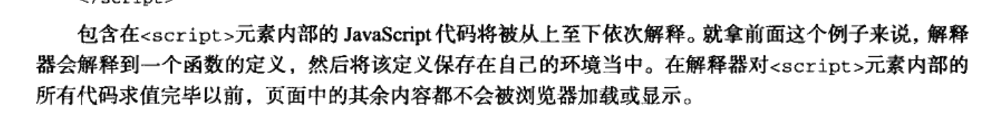
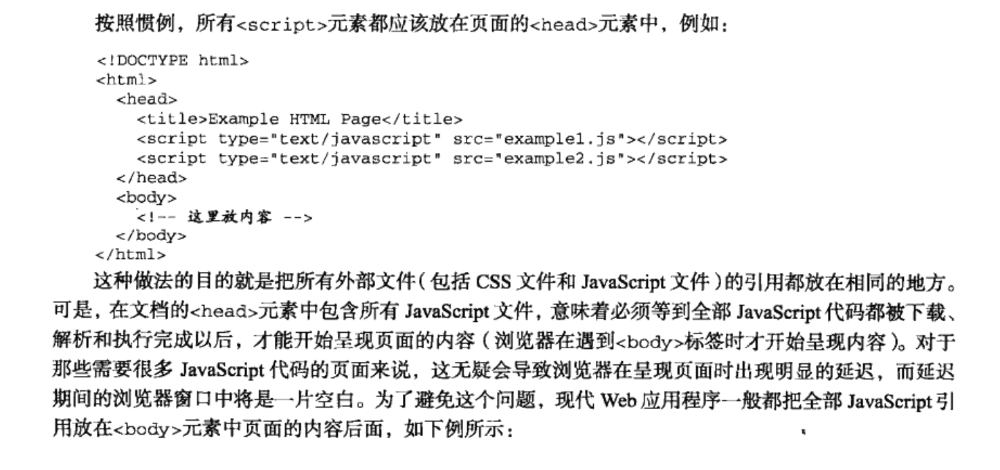

# js总结
## 是否等script脚本全部解析完成才开始呈现页面[浏览器的渲染机制]
	在P11 在对script元素内部的所有代码求值完毕之前，页面的其他内容不会被显示。


	在P13 中会从body标签页面开始渲染页面。


	浏览器请求到HTML代码后，在生成DOM的最开始阶段（应该是 Bytes →
	characters后），并行发起css、图片、js的请求，无论他们是否在HEAD里。

1. CSS文件下载完成，开始构建CSSOM。
2. 所有CSS文件下载完成，CSSOM构建结束后，和 DOM 一起生成 Render Tree。
3. 有了Render Tree，浏览器已经能知道网页中有哪些节点、各个节点的CSS定义以及他们的从属关系。下一步操作称之为Layout，顾名思义就是计算出每个节点在屏幕中的位置。
4. 浏览器已经知道了哪些节点要显示（which nodes are visible）、每个节点的CSS属性是什么（their computed styles）、每个节点在屏幕中的位置是哪里（geometry）。就进入了最后一步：Painting，按照算出来的规则，通过显卡，把内容画到屏幕上。


得到的结论：
1. 浏览器请求到html结构后，并发请求js,css,图片等资源，并不是解析到相应节点才去发送网络请求。
2. HTML解析为dom树，不是简单的自上而下，而是需要不断地反复，比如解析到脚本标签，脚本修改之前已经解析的dom，这就要往回重新解析一遍
3. HTML 解析一部分就显示一部分（不管样式表是否已经下载完成）
4. `<script>` 标记会阻塞文档的解析(DOM树的构建)直到脚本执行完，如果脚本是外部的，需等到脚本下载并执行完成才继续往下解析。
5. 外部资源是解析过程中预解析加载的(脚本阻塞了解析，其他线程会解析文档的其余部分，找出并加载)，而不是一开始就一起请求的(实际上看起来也是并发请求的，因为请求不相互依赖)

## ECMAScript中的所有参数传递的都是值,不可能通过引用传递参数

    当传递基本类型的值时，传递的是值的副本，毫无疑问。当传递的是引用类型的值时，传递的不是指针，而是一个跟指针指向相同内存地址的指针。

## eval()和Function的区别
eval()和Function构造不同的是eval()可以干扰作用域链，而Function()更安分守己些。不管你在哪里执行 Function()，它只看到全局作用域。所以其能很好的避免本地变量污染。在下面这个例子中，eval()可以访问和修改它外部作用域中的变量，这是 Function做不来的（注意到使用Function和new Function是相同的）。
```javascript
(function () {
   var local = 1;
   eval("local = 3; console.log(local)"); // logs "3"
   console.log(local); // logs "3"
}());

(function () {
   var local = 1;
   Function("console.log(typeof local);")(); // logs undefined
}());
```

## call、apply、bind传入null、undefined的情况
手动改变this指针如果传入的是null或者是undefined,this会执行全局对象。

## 变量提升优先于函数声明解析
```javascript
function a(x) {
    return x * 2;
}
var a;
alert(a);
//function a(x) {
//    return x * 2;
//}
```
## 立即执行的函数表达式的原理
告诉解析器function声明为表达式就可以,这样就可以直接调用表达式。你可以通过`()`或操作费`! + = ~ || ...`来告诉解析器。

## advantages of requestAnimationFrame
requestAnimationFrame has a number of advantages. Perhaps the most important one is that it pauses when the user navigates to another browser tab, hence not wasting their precious processing power and battery life.but `setInterval` conld't

## 模仿new的实现
借用浏览器暴露的`__proto__`接口实现new的过程

```javascript
function Person(name){
    this.name = name;
}
Person.prototype.getName = function(){
    return this.name
};

var objectFactory = function(){
    var obj = {},
    Constructor = [].shift.call(arguments);
    obj.__proto__ = Constructor.prototype;

    var ref = Constructor.apply(obj,arguments);
    return typeof ret === 'object' ? ret : obj; 
}

var a = objectFactory( Person, 'sven' );
console.log( a.name ); // 输出：sven
console.log( a.getName() ); // 输出：sven
console.log( Object.getPrototypeOf( a ) === Person.prototype ); // 输出：true
var a = objectFactory( A, 'sven' );
var a = new A( 'sven' );
```

## Object.create(null)创建没有原型的对象
js中除了根对象 Object.prototype 本身之外，任何对象都会有一个
原型。而通过 Object.create( null ) 可以创建出没有原型的对象。

## [void操作符](https://segmentfault.com/a/1190000000474941)
无论void后的表达式是什么，void操作符都会返回undefined,undefined在javascript中不是保留字