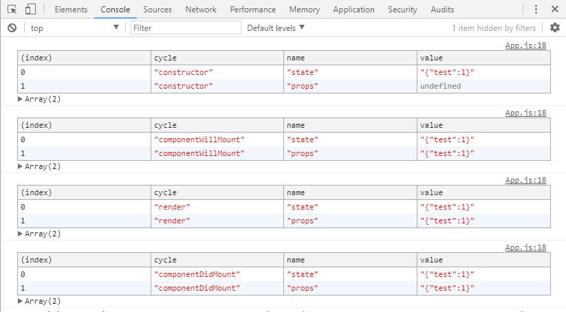
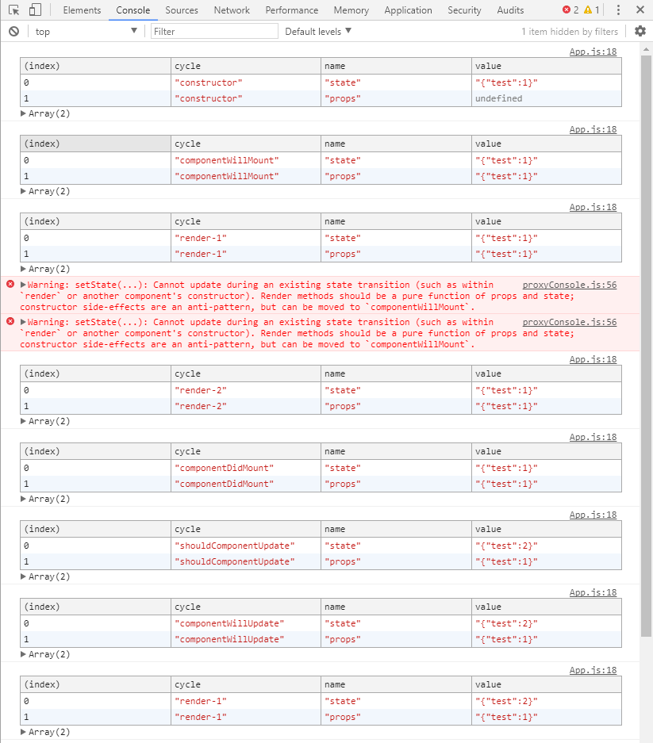
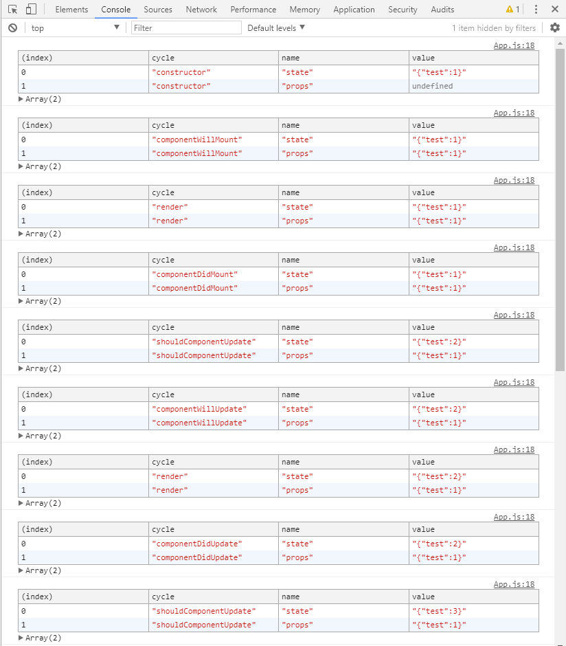

# react总结

## 业务组件剥离
一个页面有很多个部件[也可以理解为块]构成,每当`setstate or props change`时,无需更新的部件也会重新render,render会导致子组件触发render,如果这是一个组件嵌套不深构成的页面倒也无所谓,在嵌套很深的情况下这完全是不需要重新render。所以可以将页面每一块分离成组件[这里的组件是更具体的业务组件],所有的组件共享一个页面的state,组件内部通过`shouldComponentUpdate`与上一个`state`对比[建议使用Immutable.js Immutable.is()来判断],来决定自己是否更新,避免不必要的性能消耗,提升用户体验。

## 生命周期[参考](http://www.jianshu.com/p/4784216b8194)
更好的使用react必须了解它的生命周期,以便知道你该在什么时候干什么事。

1. 组件初始化 `constructor[设置初始化props、state] -> componentWillMount -> render -> componentDidMount`。
2. setState `shouldComponentUpdate -> componentWillUpdate -> render -> componentDidUpdate`。这里只有`shouldComponentUpdate`返回true或者调用forceUpdate才会执行后续步骤。
3. 父组件调用render时 `componentWillReceiveProps -> shouldComponentUpdate -> componentWillUpdate -> render -> componentDidUpdate`。这里只有`shouldComponentUpdate`返回true或者调用forceUpdate才会执行后续步骤。
4. forceUpdate `componentWillUpdate -> render -> componentDidUpdate`。
5. 卸载组件[可以这样 React.unmountComponentAtNode ] `componentWillUnmount`。

禁止在constructor、render 中修改props、state。

### 在生命周期中setState会发生什么。
  >这些列表写的东西我也看的懂[毕竟是我自己手抄的],但是在生命周期中更改state或是props会发什么什么?是走完原本的生命周期链接着走上诉2、3的链吗?反正我在写这行文字之前也是很模糊的。

  > 声明：下面的代码打印的都是最新的state和props，比如`shouldComponentUpdate`中打印的是下一个状态[如果它没有返回false的话]

#### 1.首先我们先定义一个组件。
```javascript
import React, {Component} from 'react';

class App extends Component {
  static defaultProps = {
    test: 1
  };
  constructor() {
    super();

    this.state = {
      test: 1
    }
    this.log('constructor');

  }
  log(cycle) {
    const {state, props} = this;
    console.table([
      {
        'cycle': cycle,
        name: "state",
        value: JSON.stringify(state)
      }, {
        'cycle': cycle,
        name: "props",
        value: JSON.stringify(props)
      }
    ]);
  }
  shouldComponentUpdate(nextProps, nextState) {
    this
      .log
      .call({
        state: nextState,
        props: nextProps
      }, 'shouldComponentUpdate');
      return true
  }
  componentWillReceiveProps(nextProps){
    this
      .log
      .call({
        state: this.state,
        props: nextProps
      }, 'componentWillReceiveProps');
  }
  componentWillMount() {
    this.log('componentWillMount');
  }
  componentWillUpdate(nextProps, nextState) {
    this
      .log
      .call({
        state: nextState,
        props: nextProps
      }, 'componentWillUpdate');
  }
  render() {
    this.log('render')
    return (
      <div className="App">
        text
      </div>
    );
  }
  componentDidMount() {
    this.log('componentDidMount');
  }
  componentDidUpdate() {
    this.log('componentDidUpdate');
  }
}

export default App;

```
上诉代码执行结果如下：



可以得知props是在组件`constructor`后初始化的,值的来源可能是默认的也可能是父组件传的。

#### 2.现在让我们改动下代码,在`componentWillMount`下`setState`。
```javascript
...
componentWillMount() {
    this.log('componentWillMount-1');
    this.setState({
      test:2
    });
    this.log('componentWillMount-2');
  }
...
```


1. 在`componentWillMount`下`setState`并不会触发`shouldComponentUpdate`,而是将设置的state与之前初始化的state合并,就像刚开始一起初始化的一样。
2. 更新的state并不能立即生效,在下一个周期之后[也就是render]才会生效。

#### 3.在`render`下`setState`。
```javascript
...
render() {
    this.log('render-1')
    if(this.state.test != 2){
      this.setState({
        test:3
      });
      this.setState({
        test:2
      });
      this.log('render-2')
    }
     return (
      <div className="App">
        text
      </div>
    );
}
...
```



首先这是禁止的但是为了彻底搞清楚内在的逻辑,我还是这么做了。利用了if限制了一下更新条件不然会陷入死循环。
1. 同一个函数多次修改的state会合并。
2. 更新的state并不能立即生效,在组件初始化的周期链之后才会生效。
3. 等上一个周期链结束后触发了链条2的生命周期链条。

#### 4.在`componentDidMount`下`setState`。
```javascript
...
componentDidMount() {
    this.log('componentDidMount-1');
    this.setState({
      test:2
    });
    this.log('componentDidMount-2');
}
...
```


1. 更新的state并不能立即生效,在下一个周期之后才会生效。
2. 等上一个周期链结束后触发了链条2的生命周期链条。

#### 5.在`componentWillUpdate`下`setState`。
首先想一下会发生什么?跟`componentWillMount`一样吗?嗯,应该差不多。可是这个周期压根就不会触发。我们现在`componentDidMount`中setState一下。
```javascript
...
componentWillUpdate(nextProps, nextState) {
    this
      .log
      .call({
        state: nextState,
        props: nextProps
      }, 'componentWillUpdate');

      if(this.state.test != 3){
        this.setState({
          test:3
        });
      }

}
componentDidMount() {
    this.log('componentDidMount');
    this.setState({
      test:2
    });
  }
...
```



1. 每次setState都会走一遍更新周期函数链。
2. setState的state值在下一个周期链才开始生效。[这里没有比较setState前后的state值了]

#### 6.在`componentDidUpdate`下`setState`。
首先想一下会发生什么?跟`componentWillUpdate`一样吗?是的是一样的。
```javascript
...
componentDidMount() {
    this.log('componentDidMount');
    this.setState({
      test:2
    });
  }
  componentDidUpdate() {
    this.log('componentDidUpdate');
    if(this.state.test != 3){
      this.setState({
        test:3
      });
    }
  }
...
```
1. 每次setState都会走一遍更新周期函数链。
2. setState的state值在下一个周期链才开始生效。

#### 7.在`shouldComponentUpdate`下`setState`。
首先想一下会发生什么?跟`componentWillUpdate`一样吗?不一样,就像没有设置一样。
```javascript
...
componentDidMount() {
    this.log('componentDidMount');
    this.setState({
      test:2
    });
  }
  shouldComponentUpdate(nextProps, nextState) {
    this
      .log
      .call({
        state: nextState,
        props: nextProps
      }, 'shouldComponentUpdate');
      if(nextState.test != 3){
        this.setState({
          test:3
        });
      }
      return true
  }
...
```


#### 总结
1. 在初始化周期函数链中setState,除了`componentWillMount`会与初始化的state合并,就像在`constructor`中初始化一样。其他的周期函数setState都只能在下一个周期链中拿到上一个周期链setState设置的state。
2. 在更新周期函数链[链条2]中setState[如果你设置state不加以判断的话会陷入死循环]会将这个链条执行完毕之后,在执行一次更新周期函数链并拿到先前设置的state。
3. 避免在生命周期中state,除非你万不得已的时候。
